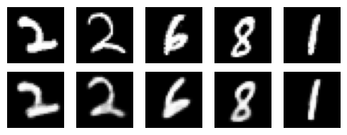
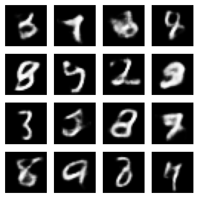
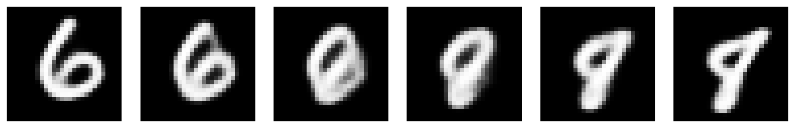

# Variational Autoencoder (VAE) from Scratch

Implementation of a Variational Autoencoder (VAE) in PyTorch, trained on the MNIST dataset.

## Personal Motivation

VAEs are generative models that combine deep learning with probabilistic inference. I implemented it from scratch to better understand the mathematics behind these models.

VAE original paper : [Auto-Encoding Variational Bayes (Kingma & Welling, 2013)](https://arxiv.org/abs/1312.6114)

## Dataset

I used the dataset [MNIST](http://yann.lecun.com/exdb/mnist/).

## Installation & Usage

The project can be run locally or on any platform with Python 3.x and PyTorch support.

You are free to modify the hyperparameters directly in the notebook. The main parameters are:
- `LATENT_DIM`: dimension of the latent space (default: 20)
- `BATCH_SIZE`: number of images per batch (default: 64)
- `LEARNING_RATE`: optimizer learning rate (default: 1e-3)
- `NUM_EPOCHS`: number of training epochs (default: 10)

Once you have the desired configuration, install the packages and run the notebook.

## Results

### Architecture

The VAE consists of three main components:

**Encoder**: Convolutional layers that compress 28x28 images into a latent representation, outputting both mean (μ) and log-variance (log σ²).

**Reparameterization**: Samples z = μ + σ × ε where ε ~ N(0,1), enabling backpropagation through stochastic nodes.

**Decoder**: Transposed convolutional layers that reconstruct 28x28 images from latent vectors.

**Loss Function**: Combination of reconstruction loss (binary cross-entropy) and KL divergence regularization.

### Capabilities

The trained model successfully:
- Reconstructs input images with high fidelity (slight blur is expected due to the probabilistic nature of VAEs)
- Generates novel digit images by sampling from N(0,1) in the latent space
- Performs smooth interpolation between different digits in latent space

### Examples Visualization

Here are examples of the model's capabilities

**Reconstruction**: The model accurately reconstructs input digits while preserving their essential features.

**Generation**: Sampling random vectors from N(0,1) and decoding them produces realistic-looking digits.

**Interpolation**: The model can smoothly morph between different digits by linearly interpolating in the latent space, demonstrating that it has learned a continuous and structured representation.

